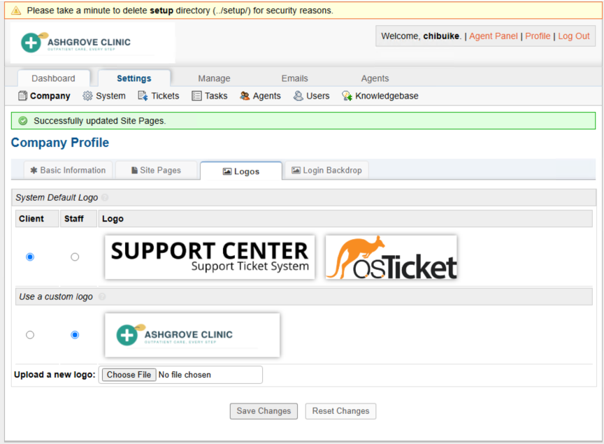

<!DOCTYPE html>
<html lang="en">
<head>
<meta charset="UTF-8">
<title>BUIKE-HELPDESK (osticket.local)</title>

</head>
<body>

  

<h1>BUIKE-HELPDESK (osticket.local)</h1>

A self-hosted support ticketing system built on Azure. Provisioning, web server configuration, PHP and MySQL setup, and application deployment, all done by hand and documented like a production rollout.

  
  

Left: creating the osticket-vm virtual machine, setting the virtual network, subnet, and public IP on the Networking tab, inside the OS-Ticktet-RG resource group. Right: the osTicket Installer's Congratulations screen, confirming osTicket v1.15.8 installed successfully, with links to the live helpdesk and the staff control panel.

<h2>Why This Project Exists</h2>

I wanted hands-on practice standing up a real application on real infrastructure instead of clicking through a cloud trial. This build takes a Windows Server VM in Azure from a blank resource group all the way to a working help desk: IIS installed and configured by hand, PHP wired in through PHP Manager, MySQL set up as the backend, and osTicket deployed and installed through its own setup wizard.

It also follows real operational habits. Every resource is named and tracked, every dependency is documented, and the one real problem I hit along the way, an HTTP 500 error from a permissions issue, is written up with what caused it and how it got fixed.

<h2>Environment</h2>

<table>
  <tr><th>Asset ID</th><th>Resource</th><th>Role</th><th>Details</th></tr>
  <tr><td>RG-OST01</td><td>OS-Ticktet-RG</td><td>Resource group</td><td>East US 2</td></tr>
  <tr><td>VM-OST01</td><td>osticket-vm</td><td>Application host</td><td>Windows Server, running IIS, PHP, and MySQL</td></tr>
  <tr><td>NET-OST01</td><td>vnet-eastus2-1</td><td>Virtual network</td><td>172.16.0.0/24</td></tr>
  <tr><td>IP-OST01</td><td>osticket-vm-ip</td><td>Public IP</td><td>Attached to VM-OST01</td></tr>
  <tr><td>NSG-OST01</td><td>osticket-vm-nsg</td><td>Network security group</td><td>Basic rule set</td></tr>
</table>

Everything lives in a single resource group so the whole build can be torn down or redeployed cleanly. Remote Desktop is the only way in, there is no separate jump box or bastion for a build this size.

<h2>Software Stack</h2>

<table>
  <tr><th>Component</th><th>Version</th><th>Purpose</th></tr>
  <tr><td>IIS</td><td>10</td><td>Web server</td></tr>
  <tr><td>PHP</td><td>7.3.8</td><td>Application runtime</td></tr>
  <tr><td>PHP Manager for IIS</td><td>1.5.0</td><td>Registers and manages PHP inside IIS</td></tr>
  <tr><td>IIS URL Rewrite Module</td><td>2</td><td>Clean URL routing, required by osTicket</td></tr>
  <tr><td>VC++ Redistributable</td><td>2015-2022 (x86)</td><td>Runtime dependency for PHP and MySQL</td></tr>
  <tr><td>MySQL Server</td><td>5.5</td><td>Database backend, Standard Configuration</td></tr>
  <tr><td>HeidiSQL</td><td>12.3</td><td>Database management client</td></tr>
  <tr><td>osTicket</td><td>v1.15.8</td><td>Help desk application</td></tr>
</table>

<h2>Installation Walkthrough</h2>

<h3>1. Provision the virtual machine</h3>

Everything starts in the Azure Portal. I created a dedicated resource group, OS-Ticktet-RG, so every piece of this build, the VM, the network, the public IP, would live in one place and be easy to clean up later if needed.

Once the resource group was set up, I created the actual virtual machine. On the networking tab I let Azure generate a new virtual network and subnet, added a public IP so I could reach the box from outside, and left the network security group on the basic setting for now.

<h3>2. Grab the installation files</h3>

With the VM deployed, I remoted into it and downloaded a zip bundle containing everything needed: osTicket itself, PHP, PHP Manager for IIS, the URL Rewrite Module, the Visual C++ Redistributable, HeidiSQL, and MySQL. Extracting the zip pulls all of that out into one folder so Windows can run the installers inside it.

<h3>3. Turn on IIS and the CGI feature</h3>

This part lives in Control Panel. Open it from the Windows search bar, go to Programs, then Turn Windows features on or off. This is where Internet Information Services gets enabled. Underneath World Wide Web Services there is a subfolder called Application Development Features, and inside that is CGI, which needs to be checked. This is what lets IIS hand PHP requests off to the PHP engine.

After enabling it, I confirmed IIS was actually running by browsing to the server's own address and seeing the default Windows welcome page.

<h3>4. Install PHP Manager and the URL Rewrite Module</h3>

PHP Manager for IIS is what lets IIS register and manage the PHP runtime, so that went in first.

Right after that came the IIS URL Rewrite Module 2, which osTicket and most PHP applications need for clean, working URLs.

<h3>5. Set up a home for PHP</h3>

Before installing PHP itself, I checked how much space was left on the C: drive, then created a plain folder at the root of C: called PHP to keep the runtime separate from the website files.

<h3>6. Install the Visual C++ Redistributable and MySQL</h3>

PHP and MySQL 5.5 both depend on the Microsoft Visual C++ 2015-2022 Redistributable, so that got installed next.

Then came MySQL Server 5.5 itself. I ran through the setup wizard and chose Standard Configuration, since this is a single machine that did not already have MySQL on it.

<h3>7. Drop the osTicket files into wwwroot</h3>

With the web stack in place, the osTicket application files went into IIS's web root at <code>C:\inetpub\wwwroot\osticket</code>, sitting right next to the PHP folder created earlier.

<h3>8. Hit an HTTP 500 error on the first try</h3>

The first attempt to load the site did not go smoothly. Browsing to <code>localhost/osticket</code> threw an HTTP 500.0 Internal Server Error, with the FastCGI module reporting error code <code>0x80070003</code> while trying to run <code>index.php</code>. This is a classic sign of an NTFS permissions problem, meaning the IIS worker process did not have the access it needed to the application folder yet.

<h3>9. Fix the folder permissions</h3>

To fix it, I opened the Advanced Security Settings on <code>ost-config.php</code>, the file inside <code>osticket\include</code> that stores the database connection details. At this point IIS_IUSRS only had Read and execute access, which was not enough.

I added a new permission entry for the Everyone group and gave it Full control, so the installer would have the write access it needed to save the configuration during setup.

<h3>10. Run the osTicket installer</h3>

With permissions sorted, the browser based osTicket Installer finally loaded the way it was supposed to. The prerequisite check confirmed PHP 7.3.8 and the MySQLi extension were good to go, with only a handful of optional extensions like IMAP and Intl missing, which are not required for a basic setup.

From there I filled out the Basic Installation form: the helpdesk name, the admin account, and the database connection details pointing at the local MySQL instance and the osticket database.

Hitting Install Now kicked off the actual installation.

<h3>11. Success</h3>

And that was it. The installer finished with a clean Congratulations screen, confirming osTicket was installed and reminding me to lock down write access on <code>ost-config.php</code> once everything was configured. From here the helpdesk was reachable at <code>localhost/osticket</code>, with a staff control panel at <code>localhost/osticket/scp</code>.

<h2>Things That Broke</h2>

<ul>
  <li><strong>HTTP 500 on the first load.</strong> Browsing to <code>localhost/osticket</code> threw an Internal Server Error, with the FastCGI module reporting error code <code>0x80070003</code> while trying to run <code>index.php</code>. Root cause was NTFS permissions: <code>ost-config.php</code> was not writable by the IIS worker process. Fixed by opening Advanced Security Settings on the file and granting the Everyone group Full control, which let the installer write the config during setup.</li>
</ul>

<h2>Build Phases</h2>

<table>
  <tr><th>Phase</th><th>Scope</th><th>Status</th></tr>
  <tr><td>1. Provisioning</td><td>Resource group, VM, and networking created in Azure</td><td>Complete</td></tr>
  <tr><td>2. Web Server</td><td>IIS installed, CGI feature enabled</td><td>Complete</td></tr>
  <tr><td>3. Runtime &amp; Database</td><td>PHP, PHP Manager, URL Rewrite Module, VC++ Redistributable, MySQL</td><td>Complete</td></tr>
  <tr><td>4. Application Deploy</td><td>osTicket files copied into wwwroot</td><td>Complete</td></tr>
  <tr><td>5. Troubleshooting</td><td>HTTP 500 error resolved via NTFS permissions fix</td><td>Complete</td></tr>
  <tr><td>6. Installer</td><td>osTicket setup wizard completed end to end</td><td>Complete</td></tr>
  <tr><td>7. Hardening</td><td>Remove write access on ost-config.php, review permissions</td><td>Planned</td></tr>
  <tr><td>8. Branding</td><td>Custom Ashgrove Clinic logo applied to client and staff views</td><td>Complete</td></tr>
</table>

<h2>Branding Update: Custom Client Logo</h2>

Once the base install and configuration phases were done, the default osTicket branding was swapped out for a custom Ashgrove Clinic logo, replacing the generic Support Center wordmark that ships with the system out of the box.

<strong>Path:</strong> Admin Panel &gt; Settings &gt; Company &gt; Logos

The Logos tab under Company Profile splits the setting into two independent choices, one for the Client-facing portal and one for the Staff control panel, each pointed at either the system default logo or a custom upload. For this build, the client-facing view was set to use the custom Ashgrove Clinic logo, while the system default stayed selected for Staff, keeping the visual distinction between the two panels intact.

<strong>Why this matters:</strong> a generic Support Center wordmark is fine for a lab environment, but it breaks the illusion the moment a hospital staff member opens the client portal expecting to see their own organization's branding. Swapping in the Ashgrove Clinic logo for the client-facing side is a small change, but it is the kind of detail that separates a raw osTicket install from something that reads as a real, client-ready deployment, which matters for how this project holds up in a portfolio review.

<h2>Repo Structure</h2>

<pre><code>.
├── README.md
├── images/          Screenshots from every phase of the build
└── docs/            Phase writeups (planned)
</code></pre>

Built and documented by Chibuike "BK" Okerulu.

</body>
</html>
