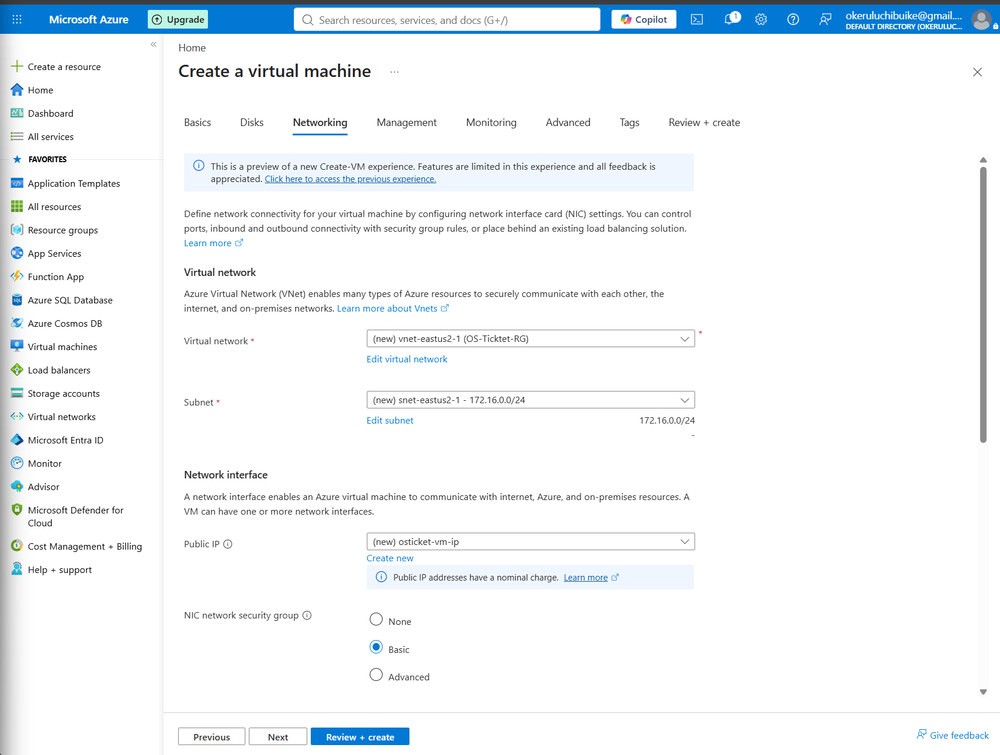

# BUIKE-HELPDESK (osticket.local)

A self-hosted support ticketing system built on Azure. Provisioning, web server configuration, PHP and MySQL setup, and application deployment, all done by hand and documented like a production rollout.

<p align="center">
  
  
</p>

<p align="center"><em>Left: provisioning the Azure VM and virtual network. Right: the finished install, osTicket live and reachable at localhost/osticket.</em></p>

---

## Why This Project Exists

I wanted hands-on practice standing up a real application on real infrastructure instead of clicking through a cloud trial. This build takes a Windows Server VM in Azure from a blank resource group all the way to a working help desk: IIS installed and configured by hand, PHP wired in through PHP Manager, MySQL set up as the backend, and osTicket deployed and installed through its own setup wizard.

It also follows real operational habits. Every resource is named and tracked, every dependency is documented, and the one real problem I hit along the way, an HTTP 500 error from a permissions issue, is written up with what caused it and how it got fixed.

---

## Environment

| Asset ID | Resource | Role | Details |
|---|---|---|---|
| RG-OST01 | OS-Ticktet-RG | Resource group | East US 2 |
| VM-OST01 | osticket-vm | Application host | Windows Server, running IIS, PHP, and MySQL |
| NET-OST01 | vnet-eastus2-1 | Virtual network | 172.16.0.0/24 |
| IP-OST01 | osticket-vm-ip | Public IP | Attached to VM-OST01 |
| NSG-OST01 | osticket-vm-nsg | Network security group | Basic rule set |

Everything lives in a single resource group so the whole build can be torn down or redeployed cleanly. Remote Desktop is the only way in, there is no separate jump box or bastion for a lab this size.

---

## Software Stack

| Component | Version | Purpose |
|---|---|---|
| IIS | 10 | Web server |
| PHP | 7.3.8 | Application runtime |
| PHP Manager for IIS | 1.5.0 | Registers and manages PHP inside IIS |
| IIS URL Rewrite Module | 2 | Clean URL routing, required by osTicket |
| VC++ Redistributable | 2015-2022 (x86) | Runtime dependency for PHP and MySQL |
| MySQL Server | 5.5 | Database backend, Standard Configuration |
| HeidiSQL | 12.3 | Database management client |
| osTicket | v1.15.8 | Help desk application |

The CGI feature under IIS's World Wide Web Services also has to be turned on by hand, it's what lets IIS hand requests off to the PHP engine. It's easy to miss since it's buried a couple of levels deep in Windows Features.

---

## Installation Notes

- **Web root:** the osTicket application files live at `C:\inetpub\wwwroot\osticket`.
- **PHP runtime:** installed to its own `C:\PHP` folder, kept separate from the site files rather than mixed into wwwroot.
- **Config permissions:** `ost-config.php` needs write access during setup. IIS_IUSRS only had Read & execute by default, which is not enough for the installer to save the database connection details. Granting the Everyone group Full control on that file during install fixed it. osTicket's own post-install guidance is to remove that write access again once configuration is done.

---

## Build Phases

| Phase | Scope | Status |
|---|---|---|
| 1. Provisioning | Resource group, VM, and networking created in Azure | Complete |
| 2. Web Server | IIS installed, CGI feature enabled | Complete |
| 3. Runtime & Database | PHP, PHP Manager, URL Rewrite Module, VC++ Redistributable, MySQL | Complete |
| 4. Application Deploy | osTicket files copied into wwwroot | Complete |
| 5. Troubleshooting | HTTP 500 error resolved via NTFS permissions fix | Complete |
| 6. Installer | osTicket setup wizard completed end to end | Complete |
| 7. Hardening | Remove write access on ost-config.php, review permissions | Planned |

---

## Things That Broke

- **HTTP 500 on the first load.** Browsing to `localhost/osticket` threw an Internal Server Error, with the FastCGI module reporting error code `0x80070003` while trying to run `index.php`. Root cause was NTFS permissions: `ost-config.php` was not writable by the IIS worker process. Fixed by opening Advanced Security Settings on the file and granting the Everyone group Full control, which let the installer write the config during setup.

---

## Repo Structure

```
.
├── README.md
├── images/          Screenshots from provisioning and the finished install
└── docs/            Phase writeups (planned)
```

---

*Built and documented by Chibuike "BK" Okerulu.*
